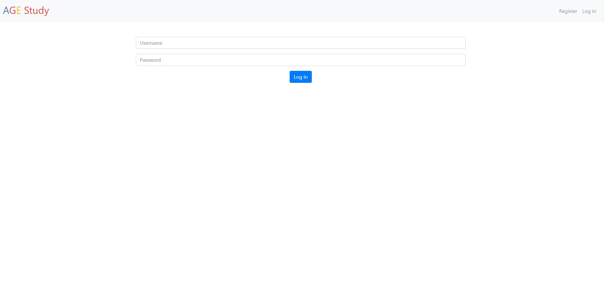

## Agestudy application
The app is built and run on IBMcloud cloudfoundry. The builtpack is python.
It connects to a DB2 instance.

# Run app locally
Set a key to your database in a file called key.txt

Set a secret_key for flask

```
FLASK_APP=application.py flask run
```

or run with http.server

```
python3 localserver_run.py
```

# Register
The register page asks the user for the following items:
- username (textbox)
- email (textbox)
- participating for money (checkbox)
- if they are able to collect money (checkbox)
- birthdate (date)
- gender
- password
- re-enter password

if the username, birthdate, gender, email or password and re-entered password is missing,
user cannot register. Those fields are required.
However, the date of birth is not stored in the database!

Javascript is used to make sure the input is of the right format
see [the javascript file]() for more information.

After registration redirect to home page.


- TODO: make email unique
- TODO: give specific feedback for username
- TODO: reCAPTCHA

# Login
Check if the username and password are correct.
Get the user information from database and set session.

If incorrect redirect user to same page and show error message
- TODO : Forgot username or password
- TOOD : Login with email possible

