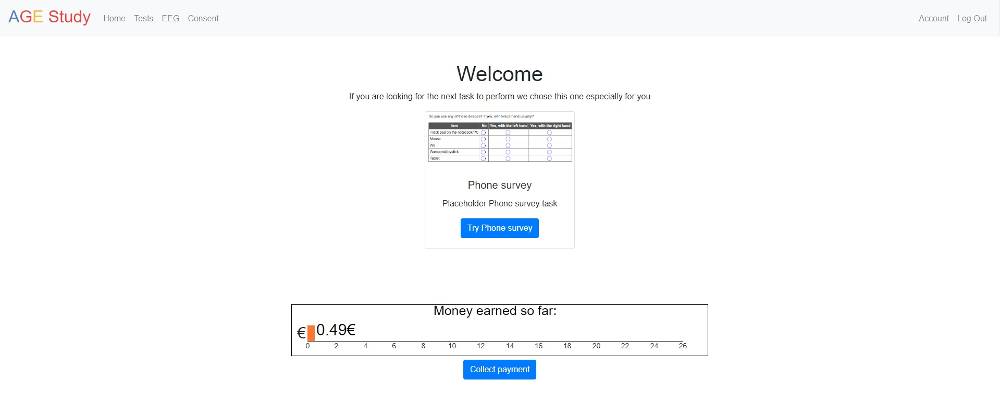
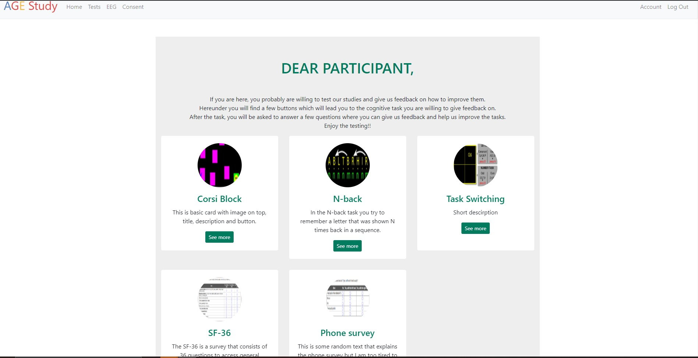
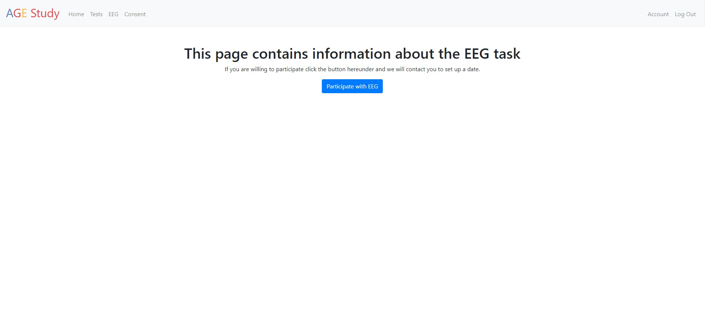
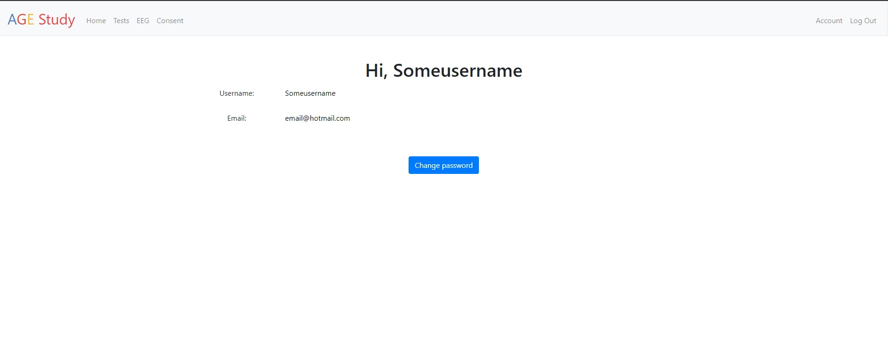

## Agestudy application
The app is built and run on IBMcloud cloudfoundry. The builtpack is python.
It connects to a DB2 instance.

# Run app locally
Set a key to your database in a file called key.txt

Set a secret_key for flask

```
FLASK_APP=application.py flask run
```

or run with http.server

```
python3 localserver_run.py
```

# Register
The register page asks the user for the following items:

| <b>Field</b>            | <b>html type</b> | <b>DB</b>                    | <b>constraints</b>                                          |
|-------------------------|------------------|------------------------------|-------------------------------------------------------------|
| username                | textbox          | VARCHAR(255) NOT NULL UNIQUE | >5chars, unique, no whitespace                              |
| email                   | textbox          | VARCHAR(255) NOT NULL        | not null, containts @                                       |
| participating for money | checkbox         | INT NOT NULL                 | not null                                                    |
| collection possible     | checkbox         | INT NOT NULL                 | not null                                                    |
| birthdate               | textbox          | DATE NOT NULL                | is date, not null                                           |
| gender                  | dropdown         | INT NOT NULL                 | not null                                                    |
| password                | textbox          | VARCHAR(255) NOT NULL        | >5chars, atleast 1 capital and 1 lowercase letter, 1 number |
| re-enter password       | textbox          | not stored                   | matches password                                            |

if the username, birthdate, gender, email or password and re-entered password is missing,
user cannot register. Those fields are required.
However, the date of birth is not stored in the database!

Javascript is used to make sure the input is of the right format
see [the javascript file]() for more information.

After registration redirect to home page.


- TODO: make email unique
- TODO: give specific feedback for username
- TODO: reCAPTCHA

# Login
Check if the username and password are correct.
Get the user information from database and set session.

If incorrect redirect user to same page and show error message
- TODO : Forgot username or password
- TOOD : Login with email possible


# Logout
Clears session and redirects to home page

# Home
Home page contains 2 features, a recommended task and a tab that keeps track of the amount of money the user had earned.
The recommended task checks if the user has completed the task already if they have not then it recommends they complete it in the following order :
- Phone survey
- SF-36
- Corsi
- N-back
- Task_switching

If they have completed the tasks it checks if its locked (which means they are unable to perform the task because they cant click on the button that leads to the task).
If not locked tasks are recommended in the above order.

The home page also contains a money tab which shows the user the amount of money they have earned so far.


TODO: Collection of the money_earned!!

# Tests
The task tab contains 5 tasks [corsi, N-back, task switching, sf-36 and phone survey]. The cards contain a link to psytoolkit for each task.
When a task is chosen it keeps track of it with the TRACKED_TASK table from the database. When the task is completed it is stored in the TASK_COMPLETED table.

- The phone survey can be completed every 5 years
- The SF-36 can be completed every half a year
- The corsi task can be completed every month
- The N-back task can be completed every month
- The task switching task can be completed every month
If the user has completed a task, per example the corsi task then the task will be locked, this means that the button that leads to the task is not shown. The task will be unlocked again after a set period, for corsi that is a month.



# EEG
Contains a button which will send us an email, we contact the user to set up an appointment.
After they click on the button they are sent to a thank you page which thanks them for their interest in participating in the EEG study and we will contact them.



# Consent
This contains the consent information for the study.

# Account
The account tab displays the username and email of the user. It contains a button where the user can change their password. They are prompted for their old existing password and asked to enter the new password twice. If the passwords don't match an error message is flashed. If they do then the password is changed and they are redirected to the tasks page.


