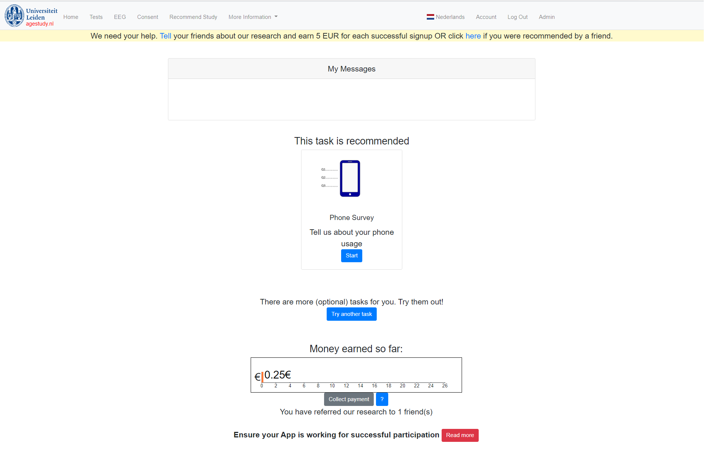

## Agestudy application
The app is built and run on IBMcloud cloudfoundry. The builtpack is python.
It connects to a postgresql instance.

# Run app locally
Set a key to your database in a file called key.txt

Set a secret_key for flask

```
FLASK_APP=application.py flask run
```

or run with http.server

```
python3 localserver_run.py
```

# Register
Register page displays checkboxes that the user need to check if they meet the requirements for participation:
- I am at least 16 years old
- I have a smartphone running Android (not an iPhone)
- I am NOT diagnosed with a current neurological or mental health condition
- I have read the participant information
- I have the 'QuantActions TapCounter' app installed on my smartphone

If all of the requirements have been met, the register page asks the user for the following items:

| <b>Field</b>            | <b>html type</b> | <b>DB</b>                    | <b>constraints</b>                                          |
|-------------------------|------------------|------------------------------|-------------------------------------------------------------|
| Email Address           | textbox          | VARCHAR(255) NOT NULL UNIQUE | not null, containts @                                       |
| Verify email address    | textbox          | VARCHAR(255) NOT NULL        | not null, containts @, matches email                        |
| Gender                  | dropdown         | INT NOT NULL                 | not null                                                    |
| Month of birth          | dropdown         | INT NOT NULL                 | not null                                                    |
| Year of birth           | dropdown         | INT NOT NULL                 | not null                                                    |
| Password                | password         | VARCHAR(255) NOT NULL        | >5chars, atleast 1 number, not null                         |
| Repeat password         | password         | not stored                   | matches password, not null                                  |
| Participating for money | checkbox         | INT                          |                                                             |
| Collection possible     | checkbox         | INT                          |                                                             |
| Consent                 | checkbox         | INT NOT NULL                 | not null                                                    |
| Recaptcha               | checkbox         | INT NOT NULL                 | not null                                                    |

After registration redirect to home page.


# Login
Check if the username and password are correct. Get the user information from database and set session.
If username or password incorrect refresh and show error message

If user forgot username, redirect to new page where they fill in their email address. If it exists then an email is sent to them.
The email contains a reset code that they can manually insert or a link that they can follow. The code and link expires after 30 minutes. 


# Logout
Clears session and redirects to home page

# Home
Home page contains 3 features, a message box, recommended task and a tab that keeps track of the amount of money the user had earned.
Admins can send messages to user through the admin box.

The recommended task checks if the user has completed the task already if they have not then it recommends they complete it in the following order :
- Phone survey
- SF-36
- Corsi
- N-back
- Task_switching

If they have completed the tasks it checks if its locked (which means they are unable to perform the task because they cant click on the button that leads to the task).
If not locked tasks are recommended in the above order.

The home page also contains a payment tab which shows the user the amount of money they have earned so far. The payment is only allowed to be connected once a year.


# Tests
The user must be sitting comfortably behind a computer to perform a test. This is confirmed through a checkbox. Only if this is checked can the user see the buttons that lead to the tests. The surveys can be completed any time and the user can sign up for EEG any time. 


The task tab contains 5 tasks [corsi, N-back, task switching, sf-36 and phone survey]. The cards contain a link to psytoolkit for each task. 
The link contains a unique identifier that ties the user to the task.
When a task is chosen it keeps track of it with the TRACKED_TASK table from the database. When the task is completed it is stored in the TASK_COMPLETED table.

- The phone survey can be completed every 3 years
- The SF-36 can be completed every half a year
- The corsi task can be completed every month
- The N-back task can be completed every month
- The task switching task can be completed every month
If the user has completed a task, per example the corsi task then the task will be locked, this means that the button that leads to the task is not shown. The task will be unlocked again after a set period, for corsi that is a month.

The user can sign up to the reminder system by clicking on the remind me button. Here an email is sent to them every month with a reminder to perform tasks.


# EEG
Contains a button which will send us an email, we contact the user to set up an appointment to participate.
After they click on the button they are sent to a thank you page which thanks them for their interest in participating in the EEG study and we will contact them.

The rest of the page contains information on performing EEG.

# Consent
This contains the consent information for the study.

# Recommend study
Users can recommend the study to others. They give out their promocode to their friend. This code is filled in when the friend registers.Alternatively it can be filled at the bottom of this page. 

If the recommended friend participates for 1 year successfully then the user gets 5 euro compensation. 

There is no limit to the number of friends a user can recommend. However, 1 user can only be recommended by 1 friend. 


# About
This contains information about the study. 

# Participate
This contains information about how to participate in the study.

# App
Contains all the information tied to the QA tapcounter app. It also has frequently asked questions related to the app.

# Contact
Contact information for the study.

# Language
This study is conducted in both English and Dutch. The user can change the language by clicking on the alternative language in the navbar. 

# Account
The account tab displays the email of the user. It also contains the participation ID and information on how to link it to the app.

It contains a button where the user can change their password. They are prompted for their old existing password and asked to enter the new password twice. If the passwords don't match an error message is flashed. If they do then the password is changed and they are redirected to the tasks page.


# Admin
Admin page is not accessible to other users.


