# Website text
This folder contains the csv files with the text used on the website.
Each csv file corresponds to each html file.

## layout.csv
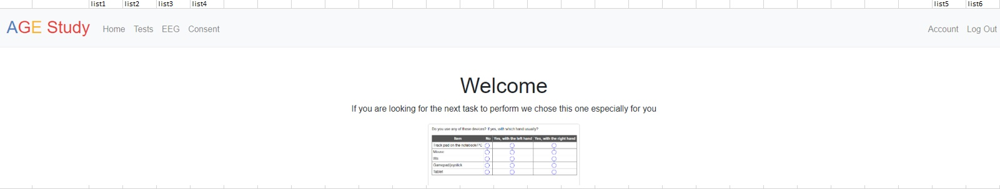
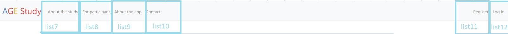

## Register.csv
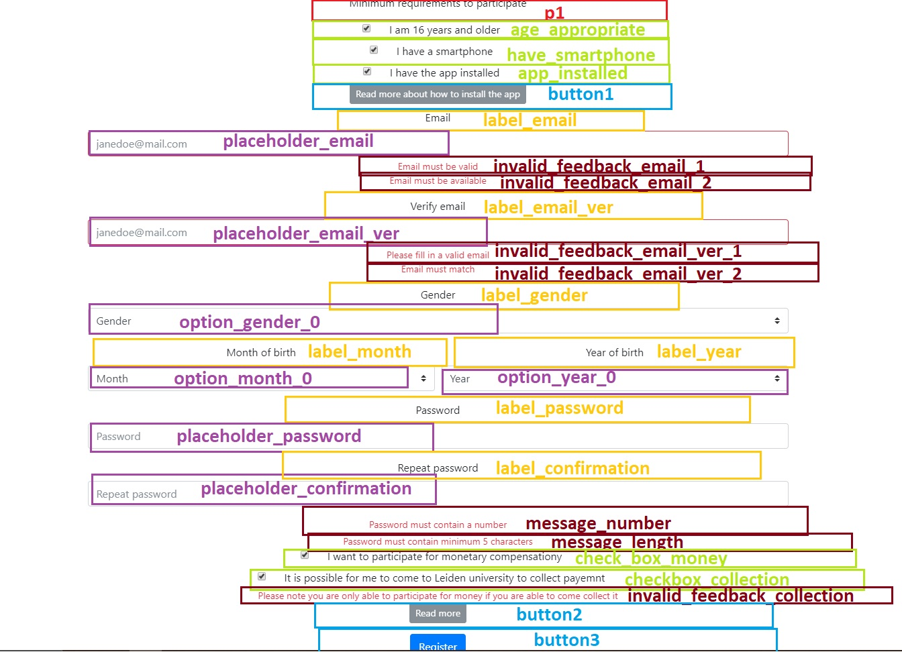
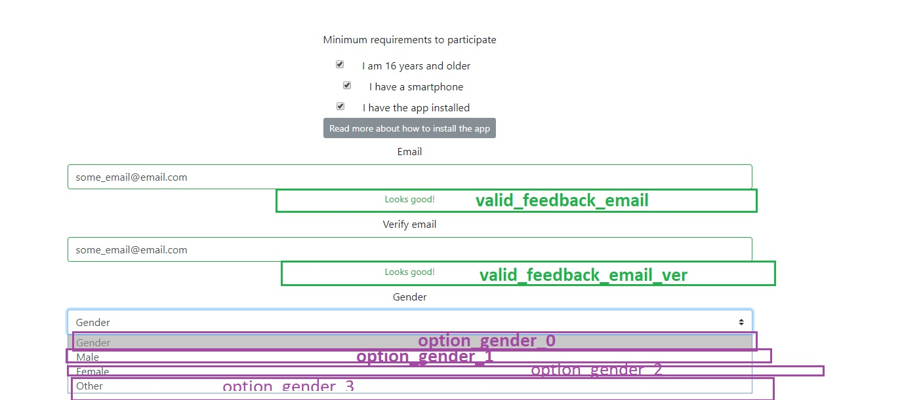
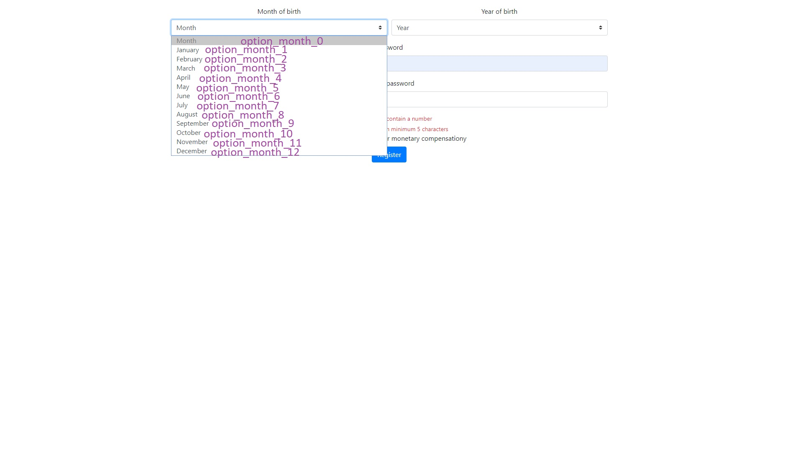

## login.csv
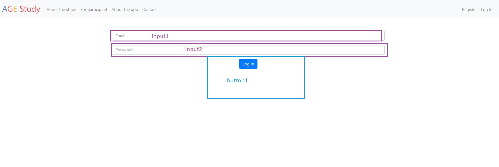

## home.csv
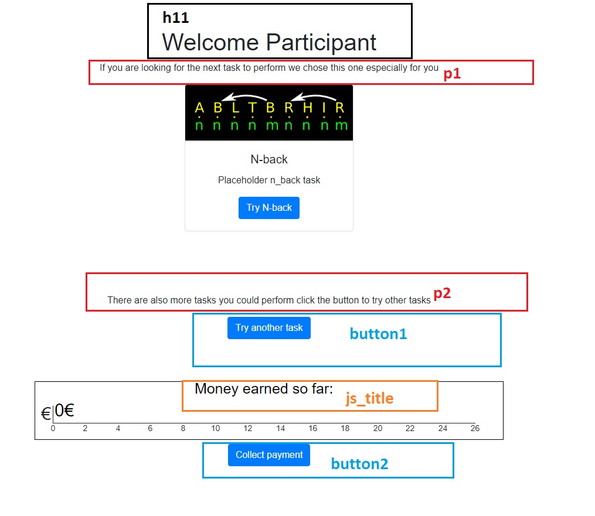

## collected.csv
When user click on the collect money button they are shown this page
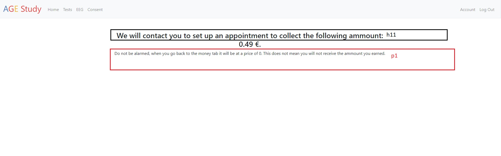

## index.csv
Contains the tests page
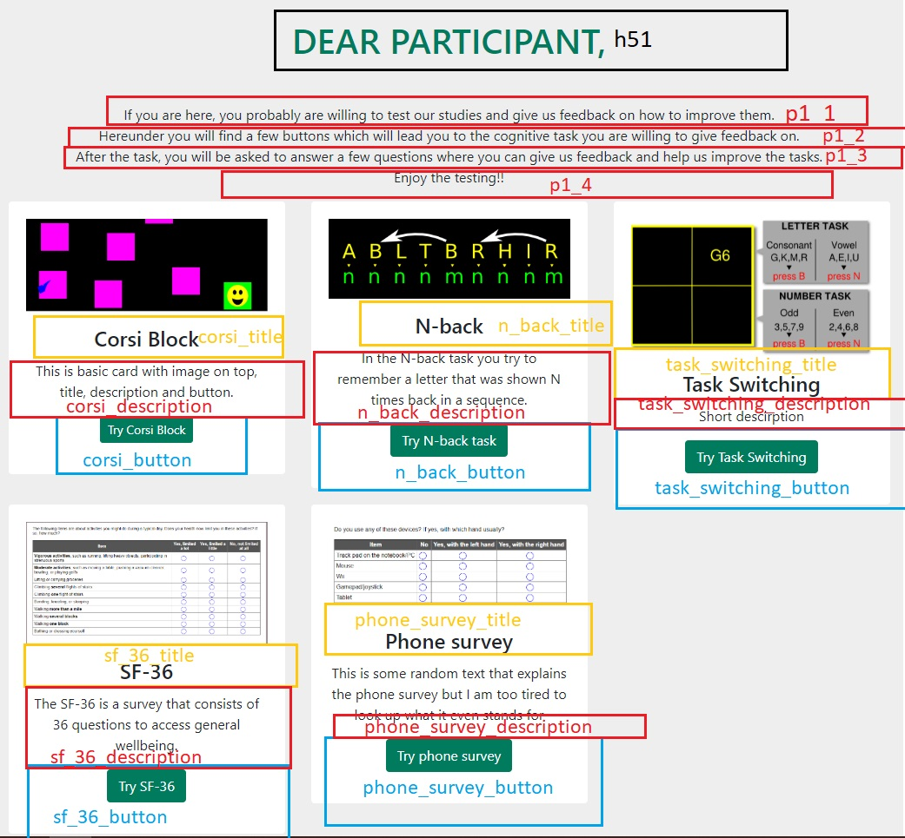

## end_task.csv
This is shown when user has completed a task.
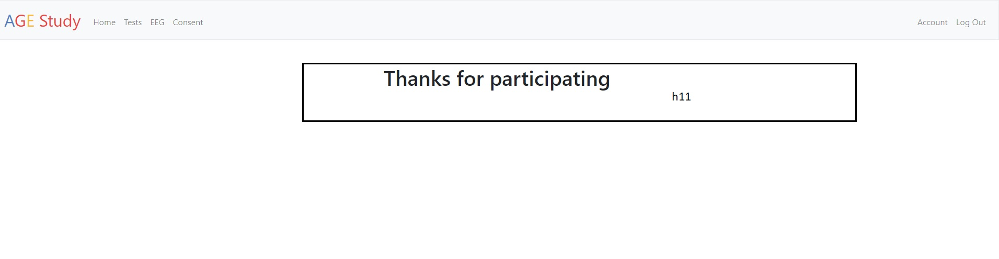

## eeg.csv
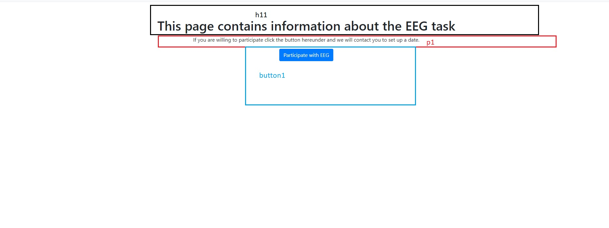

## sent_email.csv
When the user makes an appointment for eeg
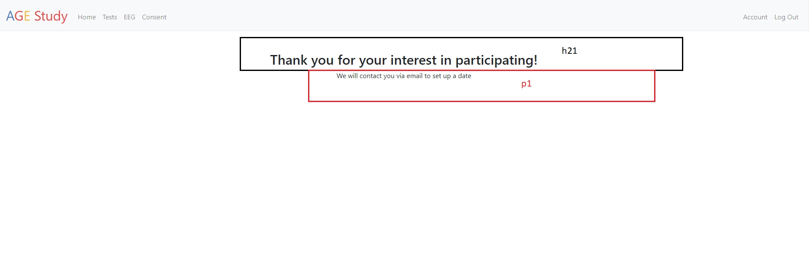

## consent.csv

## account.csv
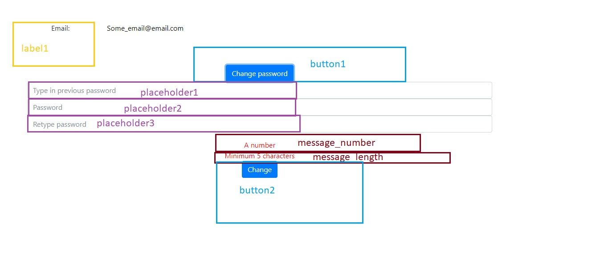

## about_study.csv
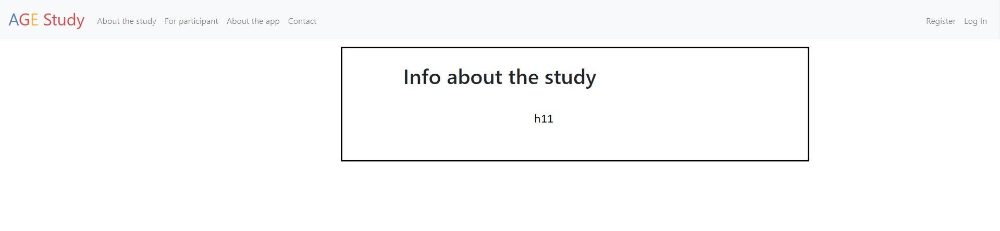

## about_app.csv

## contact.csv
