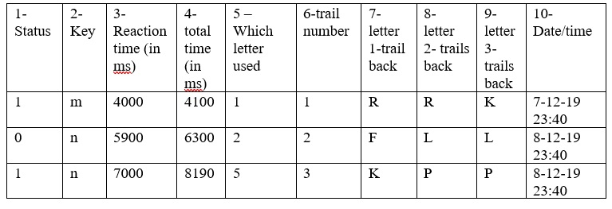

# N-back task
N back is a cognitive task used test working memory and working memory capacity.
Kirchner, W. K. (1958). Age differences in short-term retention of rapidly changing information. Journal of Experimental Psychology, 55, 352-358.
For this task, 3-back was chosen.

# Source
This experiment was copied from psytoolkit and slightly adapted.
[Link to the experiment on psytoolkit](https://www.psytoolkit.org/experiment-library/nback.html)

# Settings
***  INSERT TEXT USED FOR ALL THESE SETTINGS  ***
- About this survey:
- Contact information: (such as name of researcher, institution):
- Explicit participant consent required?  checked!
- URL at end of survey

All other settings are default.

# Data
1.	Status (correct (1=correct, 2=wrong, 3=too slow)
2.	Which key was pressed
3.	reaction time (ms)
4.	total time (response time + button release time)
5.	random number used for conditions (1=same as 3-back, 2-5 other letter)
6.	trial number
7.	the current letter
8.	the letter of the previous trial
9.	the letter of the trial before
10.	date time

